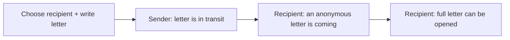

# Digital Postal Messaging — Frontend Handoff

This is the frontend contract for the Digital Postal Messaging MVP. The frontend is a separate application: it communicates only with the REST API documented by OpenAPI and must not access PostgreSQL or replicate delivery/privacy decisions locally.

## Product behaviour to preserve

The experience has two distinct states:



Before delivery, the recipient sees an anonymous arrival card and a rounded estimated date. They must not see a blank/hidden sender or message: those fields will not exist in the API response. After delivery, the same letter is revealed with its sender, content, journey, and stamps.

## Frontend responsibilities

- Build accessible authentication, profile, location, recipient-search, compose, mailbox, notification, and letter-detail screens.
- Keep access-token/session handling and API calls in one client layer; configure `API_BASE_URL` by environment.
- Render timestamps in the viewer's selected/local time zone, labelled as an estimate until delivery.
- Use API-provided visibility and state rather than guessing from a local timer. A countdown is visual only; refresh on focus, polling interval, or manual refresh.
- Handle loading, empty, offline, validation, `401`, `403/404`, `409`, and rate-limit states.
- Treat any HTML-like letter content as untrusted. The MVP should render plain text with preserved line breaks.

The backend owns authentication validation, delivery time, letter status changes, content visibility, and all authorization.

## Suggested screens and routes

| Route | Screen | API calls |
|---|---|---|
| `/login`, `/register` | Account entry | auth register/login |
| `/onboarding/location`, `/settings/profile` | select current postal location | me, locations, update location |
| `/compose` | search recipient, compose/send | user search, POST letters |
| `/mail/incoming` | anonymous in-transit and delivered inbox | incoming mailbox |
| `/mail/incoming/:id` | pending card or delivered letter | incoming letter detail; journey after delivery |
| `/mail/sent` | sent letter list | sent mailbox |
| `/mail/sent/:id` | sent letter detail | sent detail; journey |
| `/notifications` | in-app notices | notifications, mark read |

## Registration and finding recipients

The registration form has five required fields: username, display name, email, password, and postal location. A display name may be a full name, but it is a public chosen name—not a legal-name requirement.

| Field | Client validation / behaviour |
|---|---|
| Username | Show the API rule: 3–30 letters, digits, or underscores. Preserve what the user typed for display; show API uniqueness/reserved-name errors inline. |
| Display name | Required, 1–80 characters. Explain that it becomes visible to recipients after delivery. |
| Email and password | Required account credentials; do not expose them in profile/search screens. |
| Postal location | Required predefined city-level selection. Do not collect street addresses. |

On the compose screen, search by username after at least two characters and a debounce. Results contain only username and display name; show those two values and select the returned `id` as `recipientId`. Do not search by email, full name, or location. The username is immutable for the MVP, so the settings UI must not offer an edit control.

## API inventory

All routes are prefixed with `/api/v1`. Use the generated OpenAPI client when available.

```text
POST /auth/register                 POST /auth/login
POST /auth/refresh                  POST /auth/logout
GET  /me                            PUT  /me/location
GET  /locations                     GET  /locations/search?q=
GET  /users/search?q=
POST /letters                       GET  /letters/{id}
GET  /mailbox/incoming              GET  /mailbox/incoming/{id}
GET  /mailbox/sent                  GET  /mailbox/sent/{id}
GET  /letters/{id}/journey
GET  /notifications                 POST /notifications/{id}/read
GET  /stamps                        GET  /locations/{id}/stamps
```

All list endpoints should support `cursor` and `limit`. A standard error response is `application/problem+json` with `title`, `status`, `detail`, and a stable `code`; display a friendly error rather than raw server text.

### Registration request

```ts
type RegisterRequest = {
  username: string;
  displayName: string;
  email: string;
  password: string;
  locationId: string;
};
```

Build the location selector from `GET /locations`; never hardcode location IDs. On a validation failure, map the API's field errors to the corresponding form field. On success, use the returned authenticated user/session flow defined in OpenAPI rather than assuming a redirect or token shape.

## Core response shapes

These are illustrative TypeScript models; the published OpenAPI document supersedes them if a field changes.

```ts
type LetterStatus = 'IN_TRANSIT' | 'DELIVERED' | 'RETURNED';

type RecipientSearchResult = {
  id: string;
  username: string;
  displayName: string;
  // No email or postal location.
};

type IncomingInTransitLetter = {
  id: string;
  status: 'IN_TRANSIT';
  estimatedDeliveryAtUtc: string;
  displayEstimate: string; // e.g. "Around 3 September"
  // Intentionally no sender, content, origin, stamps, or journey.
};

type Party = { id: string; username: string; displayName: string };
type PostalLocation = { city: string; region?: string; country: string; countryCode: string };
type LetterStamp = { name: string; imageUrl: string; appliedAtUtc: string };
type JourneyEvent = { type: string; occurredAtUtc: string; displayLabel: string };

type DeliveredIncomingLetter = {
  id: string;
  status: 'DELIVERED';
  sender: Party;
  content: string;
  origin: PostalLocation;
  destination: PostalLocation;
  sentAtUtc: string;
  estimatedDeliveryAtUtc: string;
  deliveredAtUtc: string;
  stamps: LetterStamp[];
};

type SentLetter = {
  id: string;
  status: LetterStatus;
  recipient: Party;
  content: string;
  destination: PostalLocation;
  sentAtUtc: string;
  estimatedDeliveryAtUtc: string;
  deliveredAtUtc?: string;
  stamps: LetterStamp[];
};
```

The incoming mailbox can contain a discriminated union of `IncomingInTransitLetter | DeliveredIncomingLetter` (normally use a smaller list-card version). Switch on `status`; never expect hidden fields to become populated locally.

### Send request

```http
POST /api/v1/letters
Authorization: Bearer <access token>
Idempotency-Key: <new UUID for this user intent>
Content-Type: application/json

{ "recipientId": "uuid", "content": "Hello from Mumbai!" }
```

Disable the send control while this request is pending. If the network outcome is uncertain, retry with the **same** idempotency key; start a new key only when the user intentionally sends a new letter.

## UI states that matter

### Incoming in transit

Show: “A letter is on its way”, the rounded estimate, and an intentional waiting visual/countdown. Do not show a generic avatar, origin map, stamp placeholder, message preview, or journey progress that hints at origin.

### Incoming delivered

Show sender identity, full plain-text letter, origin/destination, delivered time, stamps, and journey after a successful detail/journey response. Offer a graceful “This letter is not available” screen for a `404` rather than implying its status.

### Sent in transit

Show recipient, content, destination, estimate, and dispatched state. This is a sender view, so it may be richer than the recipient’s pending card.

### Notifications

Notification copy is server-provided and can be shown as-is. A pending notification is anonymous; do not join it with a recipient-mailbox record to manufacture sender/origin data. Mark notifications read only after the user opens/views them.

## Integration and security notes

- Put the API origin in `API_BASE_URL`; never hardcode localhost in production code.
- Send credentials according to the chosen auth contract. If refresh uses an HttpOnly cookie, API requests that need it use `credentials: 'include'`; configure CORS on the API for the exact web origin.
- When an access token expires, refresh once, retry the original request once, then return to login if still unauthorized.
- Do not put access/refresh tokens, letter content, or full API responses in analytics, URL query parameters, error-report breadcrumbs, or persistent logs.
- Use stable API IDs as list keys. Paginate lists; debounce recipient/location search.
- Do not create client-side “delivery” events based on a timer. Refresh the server response when the estimate has passed.

## Handoff checklist

- The backend provides an accessible Swagger/OpenAPI URL and a test environment with seeded users/locations.
- The backend freezes the registration, recipient-search, send-letter, mailbox, and error schemas in OpenAPI before the frontend connects to live APIs.
- The frontend uses mocked variants for both `IN_TRANSIT` and `DELIVERED` incoming letters before the API is complete.
- Test that a pre-delivery payload has no sensitive properties, not merely that the UI hides them.
- Test time zones around midnight and an estimate changing to delivered on refresh.
- Agree on upload scope: the MVP is text-only; images/audio/postcards are future work.
- Agree on the exact authentication transport before implementation begins; it affects CORS and API-client configuration.
- Agree that username is the only MVP recipient-discovery key and is immutable after registration.
