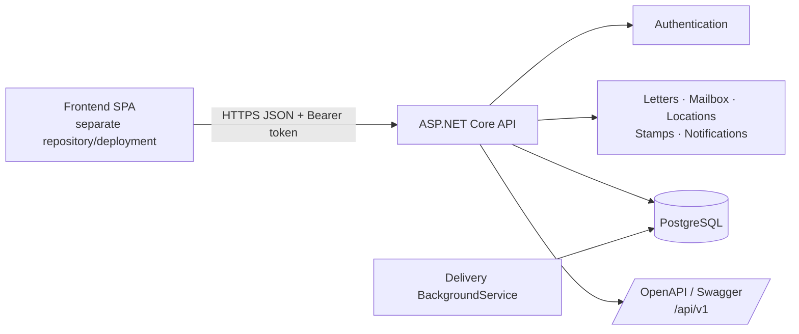
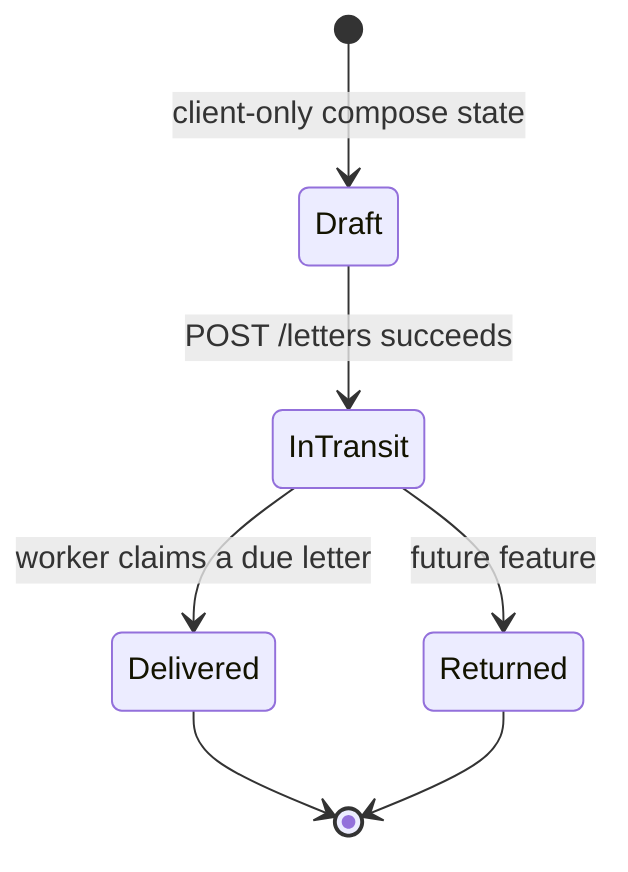
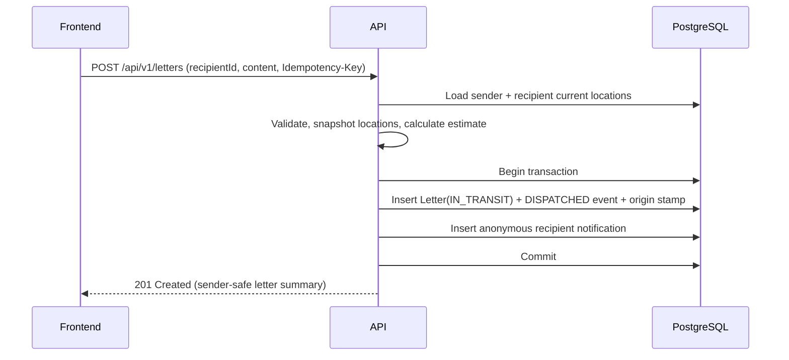

# Digital Postal Messaging — Technical Architecture

## Purpose

This document turns the product idea in [`INITIAL_DOC.txt`](../INITIAL_DOC.txt) into an implementable MVP. It is the backend/system reference; the frontend-only handoff is [`FRONTEND_HANDOFF.md`](./FRONTEND_HANDOFF.md).

## Assessment

The idea is feasible as a modular monolith and has a clear differentiator: the recipient anticipates a letter but cannot reveal its author or content until delivery. The MVP should validate whether that waiting experience is enjoyable before investing in realistic routes, collecting systems, or real postal integrations.

The key non-negotiable is **server-side anonymity**. A frontend that merely hides sender and content is insecure: browser tools, intercepted responses, and future frontend changes could expose them. Before delivery, the API must omit those fields altogether.

### Decisions for the MVP

- One ASP.NET Core API and one PostgreSQL database; no microservices.
- A separately deployed SPA frontend consuming a versioned REST API.
- Predefined city-level postal locations only. Never collect physical addresses.
- A letter uses immutable snapshots of both locations and of every applied stamp.
- The backend is authoritative for delivery time and status. The client may display a countdown, but cannot determine delivery.
- Delivery estimates should be displayed as a rounded range/date (for example, “around 3 September”), rather than an exact duration, to reduce location inference and avoid a misleading guarantee.
- The API contract is the shared boundary: OpenAPI is published with every backend release.

## System boundary



The frontend has no database access and contains no delivery or authorization business rules. It owns presentation, local UI state, accessibility, and calls to the API. The backend owns identity, validation, privacy, delivery calculation, state transitions, and all writes.

## Recommended repository split

```text
digital-postal-api/                 digital-postal-web/
├── src/                            ├── src/
│   ├── Api/                        │   ├── api/         generated/client wrapper
│   ├── Features/                   │   ├── pages/
│   ├── Domain/                     │   ├── components/
│   ├── Infrastructure/             │   └── state/
│   └── Workers/                    ├── .env.example
├── tests/                          └── README.md
├── openapi/                        
│   └── openapi.json                
└── README.md                       
```

The API repository publishes a versioned `openapi.json`. The frontend pins a compatible version or generates its typed API client during CI. Do not share database models or backend source as the frontend contract.

## Domain model

| Entity | Important data | Notes |
|---|---|---|
| `User` | account fields, `CurrentLocationId`, time zone | Current location is used only when a new letter is sent. |
| `Location` | city/country/code/coordinates/time zone | Managed predefined data. Coordinates are not exposed unless needed later. |
| `Letter` | sender/recipient IDs, location snapshots, encrypted/content field, status, timestamps, delivery data | The central immutable record after dispatch. |
| `LetterEvent` | letter, type, occurred time, optional location snapshot | Append-only audit/journey timeline. |
| `Stamp` | artwork/version/location | A catalog item. |
| `LetterStamp` | letter, stamp snapshot, event, applied time | Snapshot the visible stamp name/image/version so a later catalog edit cannot alter historic letters. |
| `Notification` | recipient user, letter, type, read time | In-app notification. Its pre-delivery copy is anonymous. |

Use separate origin/destination snapshot fields or an immutable `LocationSnapshot` value object (city, region, country, country code, coordinates, time zone). Storing only a `LocationId` is not sufficient if locations can later be edited or deactivated.

## Identity, registration, and recipient discovery

`Username` is the public, unique address used to find a recipient. `DisplayName` is the public name displayed with it after a letter arrives. `Email`, password hash, and current postal location are private account data.

Registration collects `username`, `displayName`, `email`, `password`, and `locationId`. A user may use their real/full name as the display name, but it must not be required; this product does not need legal identity verification. The location picker contains predefined city-level locations only.

| Field | MVP rule |
|---|---|
| Username | Required; 3–30 characters; ASCII letters, digits, and underscore; unique case-insensitively; normalized for uniqueness/search; reserved names rejected. |
| Display name | Required; 1–80 visible characters; not required to be a legal name. |
| Email | Required; unique case-insensitively; never included in public/search DTOs. |
| Location | Required; valid active predefined `locationId`; not included in public/search DTOs. |
| Username changes | Not supported in the MVP. Add an explicit cooldown/audit policy only if changes are introduced later. |

`GET /users/search?q=` performs a case-insensitive, prefix-oriented username search after a short debounce and returns only `id`, `username`, and `displayName`. Require at least 2 query characters, paginate results, rate-limit the endpoint, and do not offer a global browse-all-users endpoint. The sender selects a recipient by immutable `id`, not by username text, when dispatching a letter.

### Letter state machine



`Draft` is deliberately not persisted for the first MVP. Once `InTransit`, content, sender, recipient, snapshots, estimated arrival, and applied stamps cannot be edited. A retry of the same send request must use an idempotency key so a dropped network response cannot send two letters.

## Privacy and authorization matrix

| Viewer / state | Can receive | Must never receive |
|---|---|---|
| Sender, in transit | recipient public profile, own content, destination snapshot, estimate, allowed journey/stamps | recipient private data |
| Recipient, in transit | letter ID, `IN_TRANSIT`, rounded estimate, anonymous notification | sender, content, origin, origin stamp, detailed route, hidden IDs that imply origin |
| Recipient, delivered | full permitted letter, journey, stamps | unrelated private account data |
| Other user | nothing / `404 Not Found` | any indication that the letter exists |

Return `404` for a letter the caller cannot access, rather than differentiating absence from unauthorized access. Authorize every read endpoint, including notification-linked IDs and journey endpoints. Use DTOs chosen by viewer and state; never serialize the database entity directly.

## Delivery calculation

`IDeliveryTimeCalculator` receives immutable origin/destination snapshots and the send time, then returns a `DeliveryEstimate` containing duration and `EstimatedDeliveryAtUtc`.

For the first calculator:

```text
duration = base handling + (haversineDistanceKm / simulatedSpeedKmPerHour)
           + international surcharge when country differs
```

Keep base time, speed, surcharge, minimum, maximum, and display rounding in configuration. Clamp the result to product-approved bounds; otherwise a local letter can appear instantly or an intercontinental letter can feel unreasonably long. Store the UTC timestamp, source calculation version, and input distance for diagnostics; convert only for display using the viewer's time zone.

## Send-letter transaction



Validate authentication, recipient existence, self-send policy, location availability, message size/format, rate limit, and block/report policy (when introduced) before committing. The anonymous notification should say only that a letter is travelling and its rounded estimated arrival.

## Delivery worker

Run an `IHostedService`/`BackgroundService` at a modest polling interval (for example 30–60 seconds). It uses database state, so restarts do not lose deliveries.

For every batch of due letters (`Status = IN_TRANSIT` and `EstimatedDeliveryAtUtc <= now`), claim work atomically. With PostgreSQL, use a transaction and row locking such as `FOR UPDATE SKIP LOCKED`, then transition each claimed letter only if it remains `IN_TRANSIT`. In the same transaction:

1. set `Status = DELIVERED` and `DeliveredAtUtc`;
2. append the `DELIVERED` event;
3. apply the destination stamp snapshot;
4. create the delivery notification.

This makes multiple API/worker instances safe. Make notification creation unique per `(LetterId, Type)` and protect event/stamp writes with appropriate unique constraints so retries are idempotent.

## REST contract conventions

- Base URL: `/api/v1`; breaking changes require `/api/v2`.
- JSON uses camelCase; all persisted timestamps are ISO-8601 UTC strings.
- Authentication: short-lived access token in `Authorization: Bearer <token>`; use a secure, HttpOnly, SameSite refresh cookie where the chosen frontend deployment model supports it. Do not store refresh tokens in local storage.
- Pagination: `?cursor=...&limit=...`, returning `items` and `nextCursor`.
- Errors: RFC 7807 `application/problem+json`, with stable machine-readable error codes.
- `POST /letters` accepts `Idempotency-Key`; duplicate keys return the original successful result.
- CORS allows only the configured frontend origin(s), methods, and headers. Production requires HTTPS.

Minimum request shapes to freeze in OpenAPI before parallel implementation:

```json
POST /auth/register
{
  "username": "rahul_writes",
  "displayName": "Rahul Sharma",
  "email": "rahul@example.com",
  "password": "user-chosen secret",
  "locationId": "uuid"
}

PUT /me/location
{ "locationId": "uuid" }

POST /letters
{ "recipientId": "uuid", "content": "Plain-text letter content" }
```

The backend validates and returns field-level validation errors using the agreed Problem Details extension (for example `errors.username`). Do not make a registration API that silently normalizes a username into a different visible value; return the canonical accepted username in the successful account response.

The endpoint inventory and frontend response models are in [`FRONTEND_HANDOFF.md`](./FRONTEND_HANDOFF.md). Swagger is authoritative once the API exists.

## Database integrity and operational requirements

Add foreign keys for all ownership relationships and indexes on `Letters(SenderId)`, `Letters(RecipientId)`, `Letters(Status, EstimatedDeliveryAtUtc)`, `LetterEvents(LetterId, OccurredAtUtc)`, and `Notifications(UserId, ReadAtUtc)`. Use a unique index for idempotency keys scoped to the sender.

Do not log letter content, access tokens, refresh tokens, or full password-reset/authentication secrets. Passwords use a modern adaptive hash via the platform identity library. Add request-rate limits for auth, recipient search, and sending; cap content length; escape/sanitize rendered content; and produce audit logs for dispatch/delivery transitions without content.

Back up PostgreSQL, expose health checks for API/database/worker, and record worker batch failures. Notifications may initially be in-app only; email/push delivery should be an outbox-backed future addition, not part of the transactional MVP.

## Implementation order

1. Create the solution, PostgreSQL migrations, configuration, health checks, authentication, and OpenAPI publishing.
2. Seed postal locations and implement profile location selection plus recipient search using privacy-safe results.
3. Implement the letter domain, calculator, dispatch transaction, sender views, and anonymous incoming views.
4. Implement the safe delivery worker, delivered views, events, destination stamps, and notifications.
5. Build the frontend against the published OpenAPI contract; test the pre-delivery response payload explicitly.
6. Add integration tests for username uniqueness/search privacy, authorization, immutability, time-zone display, idempotent dispatch, and concurrent worker claims.

## MVP acceptance checks

- Sending a letter takes a snapshot of both locations; later profile changes do not alter it.
- Recipient pre-delivery API responses contain no sender, content, origin, origin stamp, or route data.
- The sender can see their own dispatched content and delivery estimate.
- At/after the stored delivery timestamp, exactly one delivery event, destination stamp, and delivery notification exist.
- A restart or two worker instances do not double-deliver a letter.
- An unrelated user cannot discover a letter or its notification.
- Recipient search returns only username, display name, and ID—never email or location—and accepts no duplicate username differing only by case.
- The frontend can be developed and deployed independently using only the OpenAPI contract and environment-specific API URL.
